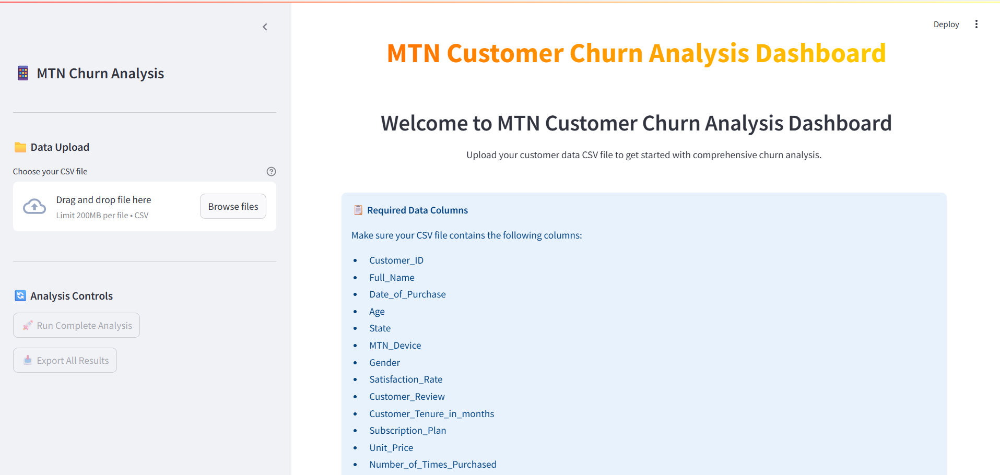
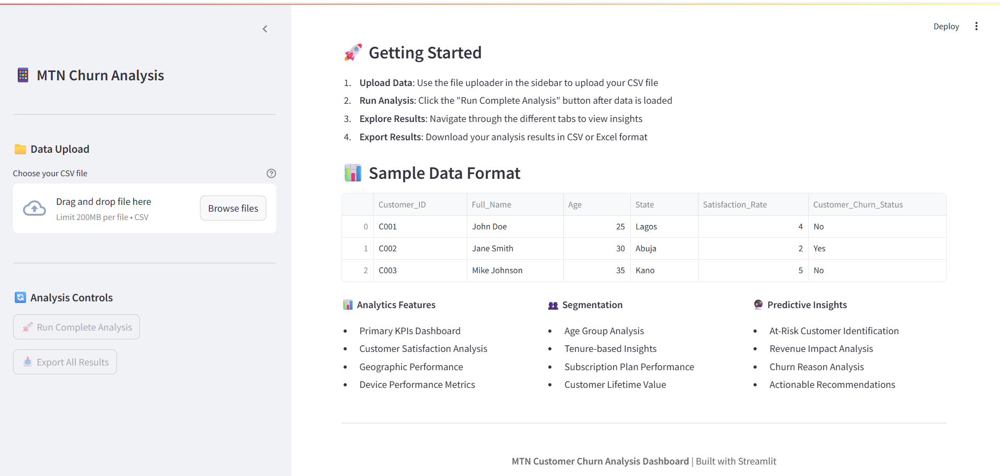
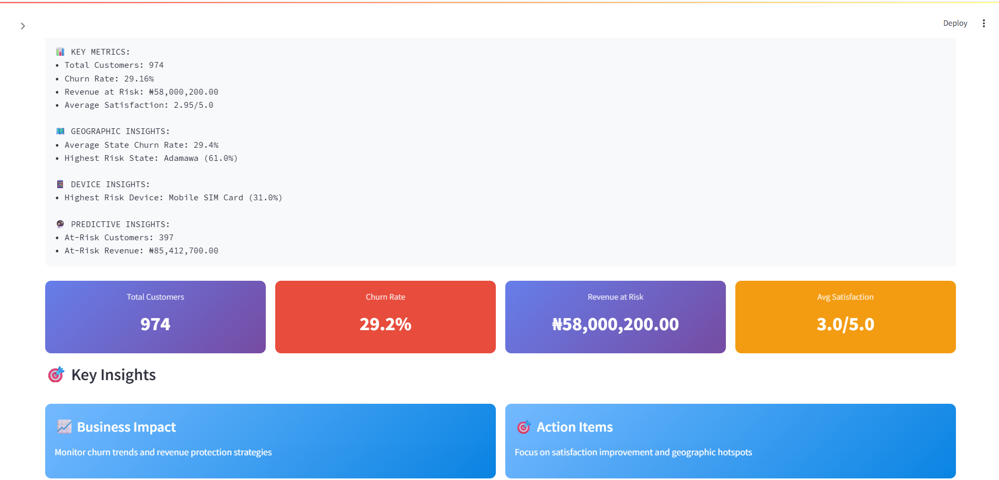
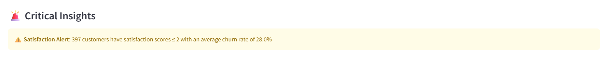
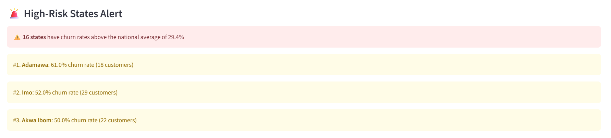
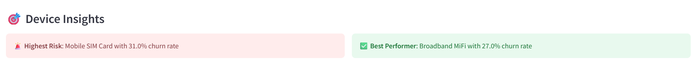
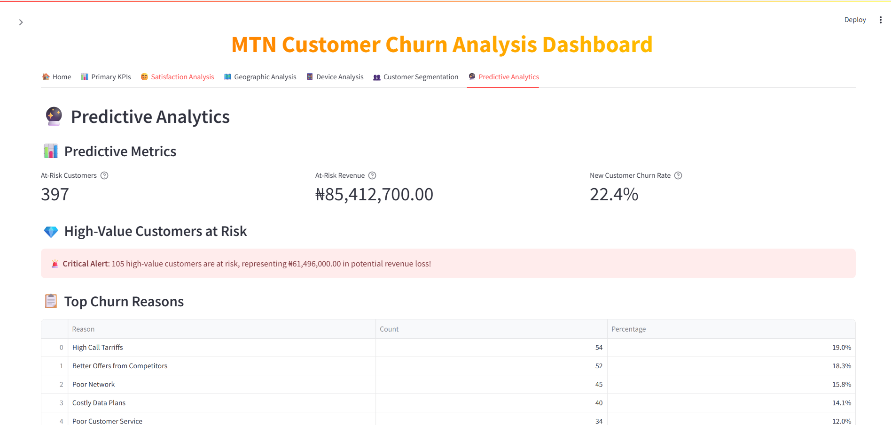
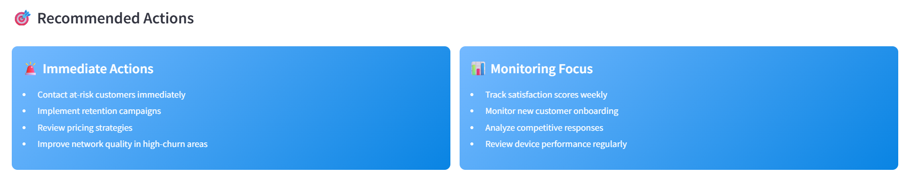

📱 MTN Customer Churn Analysis Dashboard
Interactive Data-Driven Platform for analyzing and visualizing MTN Nigeria's customer churn dynamics. Built with Python, Pandas, Streamlit, and Plotly, it enables hands-on exploration of churn trends, root causes, and strategic action planning.

🚀 Project Overview
MTN Nigeria's churn rate was found to be ~29%, with behaviour varying significantly across demographics, devices, regions, and subscription plans 

This project:

Identifies churn drivers through satisfaction scores, device types, and data plans

Visualizes churn hotspots across states

Pinpoints high-risk and high-value segments

Offers actionable recommendations for retention 

📂 Repository Structure

├── mtn_churn_model.py           # Data cleaning, KPI & churn analysis logic

├── mtn_streamlit_dashboard.py   # Streamlit app displaying interactive dashboards

├── data/                        # Raw csv data file

├── assets/                      # Images for README and dashboard UI

├── requirements.txt

└── README.md                    # This file

📎 Dataset

➡️ Download the dataset here: [https://www.kaggle.com/datasets/oluwademiladeadeniyi/mtn-nigeria-customer-churn] 

🎯 Key Insights & Visualizations

Overall Churn Rate: ~29%, with variations by plan, device, and region 

High-Risk Segments: Pre-paid mobile SIM users and 65GB monthly data subscribers churn most 

Device Effect: Advanced devices (e.g., 5G routers) correlate with lower churn 

Regional Patterns: Urban states like Lagos and Abuja show elevated churn — ripe for targeted retention strategies 

Revenue-Value Paradox: High-revenue, satisfied customers display stronger loyalty, indicating premium service retention potential

🏗️ Features
Key Metrics Dashboard: Total size, churn rate, revenue loss, average satisfaction

Satisfaction Insights: Correlations between satisfaction scores and churn

Device & Plan Breakdown: Visuals on churn by device type and plan tier

Geospatial View: Heatmaps of churn across states

Segment Filtering: Drill-downs by age, tenure, device, and region

Use-case Monitoring: Track-at-risk users (low satisfaction), new joiners, and high-value cohorts

Export Capability: Download analysis results as CSV/Excel

🎬 Usage Guide
Prerequisites: Python 3.8+ installed

Clone the repo

Install dependencies using the requirements.txt file

Run the dashboard

Streamlit run dashboard.py

📸 Screenshots

Landing Page;

KPI Summary;

Critical Satisfaction Insight;

Geographic Analysis (High Risk States)

Device Analysis Insight;

Predictive Analysis & Action Plan;

Overview	Satisfaction Insights	Device & Plan Analysis

💡 Analysis Recommendations

Engage At Risk Customers

Implement Retention Campaigns

Review Pricing Strategies

Improve Network In High-Churn Areas

Proactively support key customers with higher-touch service (account managers, feedback loops)

👤 Author
Osigbemhe Anegbe – Data Analyst
